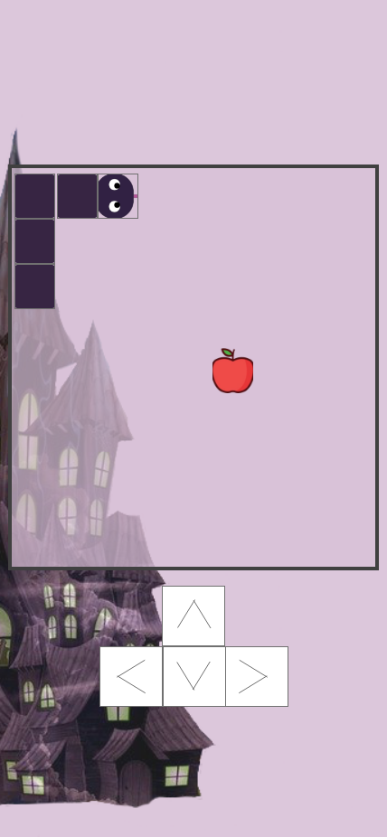

# The Snake & the Wizard

## Overview

This is a web based game inspired by the Nokia 3310 version of Snake. The aim of the game is to grow the snake by eating the fruit that randomly spawn onto the board without hitting the boarder or without hitting your own tail. The website uses basic **HTML** and **CCS** to create the static components of the game. All the interactive features, including movement are made using **JavaScript**. The game will be responsive for all devices.

[Live Website](https://datonex.github.io/snake-and-the-wizard/)

[GitHub Repository](https://github.com/datonex/snake-and-the-wizard)

## Table of Contents (generate here)

## UX

Use this section to provide insight into your UX process, focusing on who this website is for, what it is that they want to achieve and how your project is the best way to help them achieve these things.

In particular, as part of this section we recommend that you provide a list of User Stories, with the following general structure:

- As a user type, I want to perform an action, so that I can achieve a goal.

This section is also where you would share links to any wireframes, mockups, diagrams etc. that you created as part of the design process. These files should themselves either be included as a pdf file in the project itself (in an separate directory), or just hosted elsewhere online and can be in any format that is viewable inside the browser.

### User Stories

- #### As a user who wants to play a quick game on my commute

1. I want to have access to the game on the go

2. I want to easily start the game

3. I want to be able to see a balance of images and text

4. I want to be able to easily see my score

5. I want responsive touch interaction on a mobile device

6. I want to be able to pause the game

- #### As a user at home

1. I want to have access to the website on any device and on the go

2. I want the buttons to be easy to see and be responsive

3. I want responsive touch interaction on mobile device or tablet

4. I want to be able to use the arrow buttons, or the WASD buttons to control the snake's direction on desktop computer

5. I want to be able to pause the game

### Design

#### Game Story

Story of the game came from my love of Scooby Doo as a child. They always encountered scary looking houses and all kinds of "monsters". In this game however the monster is real! You were turned into a snake by a wizard and he locked you up in a very large empty room in his large house. The room as no windows and the door can only be opened by the wizard's magic. However the wizard is unaware of a very important fact that could give you a chance to escape, whenever he is asleep, he spontaneously spawns all kinds of fruit in that empty room that you are trapped in. He also doesn't know that the fruit's have powers that make you grow very quickly. While stuck in there you got hungry and ate the fruit without thinking. When you realised that you grew longer, you had an idea to eat the fruit and grow large enough to make the room collapse on itself and escape.

#### Colour Scheme

The colour theme of the game is based on one of my favourite colour's, purple. I found a background with the colours I want and based the colour scheme from there. I used [**Adobe Color - Image**](https://color.adobe.com/create/image) to pick colours from the images and automatically generate colours for me.

The darkest colour in the grid was too dark, so I used [**Adobe Color - Wheel**](https://color.adobe.com/create/color-wheel) to determine a slightly lighter color that will best suit the scheme.

#### Typography

Font used for the heading was Mystery Quest with a back-up font of sans-serif. The font is eye catching and the swirls in the writing match the title of the game in terms of theme.

Font used for main text was Quicksand with a back-up font of sans-serif. The font is easy to read, well spaced out and goes well together with Mystery Quest.

#### Imagery

The background of the page is a haunted house type of building to decorate the page and fit in with context to the story.

#### Wireframes

Wireframes were created using Adobe Xd.

- Mobile Wireframe

- Tablet Wireframe

- Desktop Wireframe

#### Mockups

The game has mostly remained the same in terms of general structure. New feature since the wireframe has been added such as:

- Main Menu

- Game instructions

- Game states, including Pause, Game Over, Play and Setting Page

### Existing Features

#### Common Features Across All Pages

- [x] **Links** that are hovered over

- All links that are surrounding text have been underlined and change color when hovered over. This helps the user to identify external links. This excludes the action buttons on the main game screen.

- [x] **Responsiveness**

- All pages work well with many screen sizes.

- Buttons are consistent with theme.

- [x] **Fonts**

- All text is large and easy to read.

- [x] **Accessibility**

- Clear contrast between the background and text.

- Colour theme do not conflict for those who are colour blind.

### Specific to Pages

- [x] **Main Menu**

- Main menu format is consistent across all devices

- [x] **Game Page**

- Instructions for the game are easily accessible.

- All devices are able to pause the game.

- Game difficulty increases during the game by increasing speed

- User has access to the high score.

### Features Left to Implement

- Be able to change the grid size from the settings page

- Be able to change the fruit displayed on the page from the snake to eat

- Disable minor scrolling from browser on mobiles when swiping

- Add Sound to Game

## Technologies Used

### Languages used

- [**HTML**](https://en.wikipedia.org/wiki/HTML5) for static text and containers for the game, and buttons.
- [**CSS**](https://en.wikipedia.org/wiki/CSS) for styling of the game.

- [**JavaScript**](https://www.javascript.com/) for the interactive features of the game.

### Frameworks, Libraries and Programs Used

- [**Fontawesome _v.5.15.3_**](https://fontawesome.com/) was used to insert icons arrows for the on-screen buttons in the game

- [**Favicon**](https://favicon.io/) was used to generate favicon and copied the syntax copied from website.

- [**Google Fonts**](https://fonts.google.com/) was used to import **Mystery Quest** and **Open Sans** fonts in the style.css stylesheet.

- [**Visual Studio Code**](https://code.visualstudio.com/) is a source-code editor optimised for debugging, syntax highlighting and extension support.

- [**Git**](https://git-scm.com/) was used to allow for tracking of any changes in the code and for the version control.

- [**Github**](https://github.com/) is used to host the project files and publish the live website by using GitPages.

- [**TinyPNG**](https://tinypng.com/) used to reduce resolution of images

- [**Adobe Illustrator**](https://www.adobe.com/uk/creativecloud/illustration.html) was used to draw the snake head and body vectors.

- [**Adobe Xd**](https://www.adobe.com/ie/products/xd.html) was used to create wireframes for mobile, tablet and desktop.

- [**Lunapic**](https://www5.lunapic.com/editor/) was used to remove background from images to create `.png` files

- [**Swiped Events**](https://github.com/john-doherty/swiped-events) was used to add swipe controls to game.

## Testing

- ### External links

- Link to Github repository on credits page opens in a new tab and leads to this README

- ### Internal Links

- **Start Game Button** opens a new page in the browser to the game instructions screen

- **Credits Button** button shows the credits box as expected

- **Back Icons** and **Main Menu Buttons** buttons in credits box and main game all lead to Main Menu as expected

- **Instruction page** Tapping, and spacebar all toggle lead to the main game board

- **Refresh Icon**, **Restart Button**, **Try Again Button** reloads the game page

- **Setting Icon** Pauses the game and opens the settings box and refreshes game

- **Pause Icon** Pauses and continues game as expected

- ### Button Events

- **Arrow Keys** Move snake in expected direction

- **WASD Keys** Move snake in expended direction

- ### Swipe Events

- **Swipe Directions** snake moves in expected swipe direction and are responsive

### CSS3 validator

Pass

### HTML5 Validator

**Home Page** - Pass
**About Page** - Pass
**Contact Us** - Pass
**Travel Information Page** - 2 Errors

1. Error: The element a must not appear as a descendant of the button element

- From line 345, column 63; to line 345, column 118

`="button"><a href="https://www.evisa.gov.zw/home" target="_blank">Apply`

<!-- markdownlint-disable-next-line MD029 -->

2. Error: The element a must not appear as a descendant of the button element.

- From line 376, column 38; to line 376, column 89

`="button"><a href="https://www.expedia.co.uk" target="_blank">Book f`

### Compatibility Testing

- Browser Compatibility

| Screen size\Browser |       Safari       |    Opera    | Microsoft Edge |       Chrome       |      Firefox       | Internet Explorer |
| ------------------- | :----------------: | :---------: | :------------: | :----------------: | :----------------: | :---------------: |
| Mobile              | :heavy_check_mark: | Not Tested  |  Not Tested.   | :heavy_check_mark: | :heavy_check_mark: |    Not Tested     |
| Desktop             | :heavy_check_mark: | Not Tested. |  Not Tested.   | :heavy_check_mark: | :heavy_check_mark: |    Not Tested     |
| Tablet              | :heavy_check_mark: | Not Tested. |  Not Tested.   | :heavy_check_mark: | :heavy_check_mark: |    Not Tested     |

- OS Compatibility was tested on iOS 14.5.1, MacOS Catalina, iPadOS 14.5 It is yet to be tested on Unix, Linux, Windows or Solaris Operating Systems.
- The devices used in this testing include MacBook Pro, iPad Pro, iPhone 12 Pro Max, iPhone 7 Plus.

- The website was exhaustively tested for responsiveness on [Chrome DevTools](https://developers.google.com/web/tools/chrome-devtools). Different viewport sizes were simulated ranging from as small as iPhone 5 (320px) to large desktop sizes (1200px and above).

## Deployment

This section should describe the process you went through to deploy the project to a hosting platform (e.g. GitHub Pages or Heroku).

In particular, you should provide all details of the differences between the deployed version and the development version, if any, including:

- Different values for environment variables (Heroku Config Vars)?
- Different configuration files?
- Separate git branch?

In addition, if it is not obvious, you should also describe how to run your code locally.

This website was published using [GitHub Pages](https://pages.github.com/).

1. Go to the GitHub.com and log in.
2. On the left-hand side, you'll see all your repositories, select the appropriate one.
3. Under the name of your chosen Repository you will see a ribbon of selections, click on 'Settings' located on the right hand side.
4. Scroll down till you see 'Pages' heading.
5. Under the 'Source' click on the dropdown and select 'master branch'
6. The page will reload and you'll see the link of your published page displayed under 'GitHub' pages.
7. It takes a few minutes for the site to be published, wait until the background of your link changes to a green color before trying to open it.

### Contribution

1. Firstly you will need to clone this repository by running the `git clone <https://github.com/datonex/visit-zimbabwe/>` command
2. If using VS Code type make sure you have th Git extension installed then type about code into your terminal
3. Download the [Live Server](https://marketplace.visualstudio.com/items?itemName=ritwickdey.LiveServer) extension, one installed find the go live button at the bottom right of your vscode window
4. The project will now run on [localhost](http://127.0.0.1:5500/)
5. If using Gitpod use the command `python3 -m http.server`
6. Make changes to the code and if you think it belongs in here then just submit a pull request

## Credits

### Content

Each bit of content must have its own link and displayed as a list

- The text for section Y was copied from the [Wikipedia article Z](https://en.wikipedia.org/wiki/Z)

### Media

Each bit of content must have its own link and displayed as a list

#### Images

- [Fruits](https://www.vecteezy.com/vector-art/148485-fruit-icon-pack) by Jellyfish from Vecteezy

- [Spooky Castle](https://pixabay.com/illustrations/spooky-castle-fantasy-scary-trees-5944873/) by ParallelVision from Pixabay

- Favicon image of snake obtained from [Twemoji](https://twemoji.twitter.com/), graphics licenced under [CC-BY 4.0](https://creativecommons.org/licenses/by/4.0/)

#### Audio

- [Game over](https://mixkit.co/free-sound-effects/) from mixkit
- epidemic sound

#### Video

- video was obtained from [here](https://linkhere.com)

### Acknowledgements

#### Coding resources used

- Game logic from [WebDev Simplified Channel](https://github.com/WebDevSimplified/Javascript-Snake-Game) from snake tutorial
- key code values [WesBos](https://keycode.info/)
- Code Institute [Love Maths](https://github.com/Code-Institute-Solutions/love-maths-2.0-sourcecode) Project
- How to access local storage using **JavaScript** from [Michael Karen](https://michael-karen.medium.com/how-to-save-high-scores-in-local-storage-7860baca9d68)
- Game user interface [Steven Lambert](https://blog.sklambert.com/html5-game-tutorial-game-ui-canvas-vs-dom/)

- Thank you to my mentor for his support and guidance
